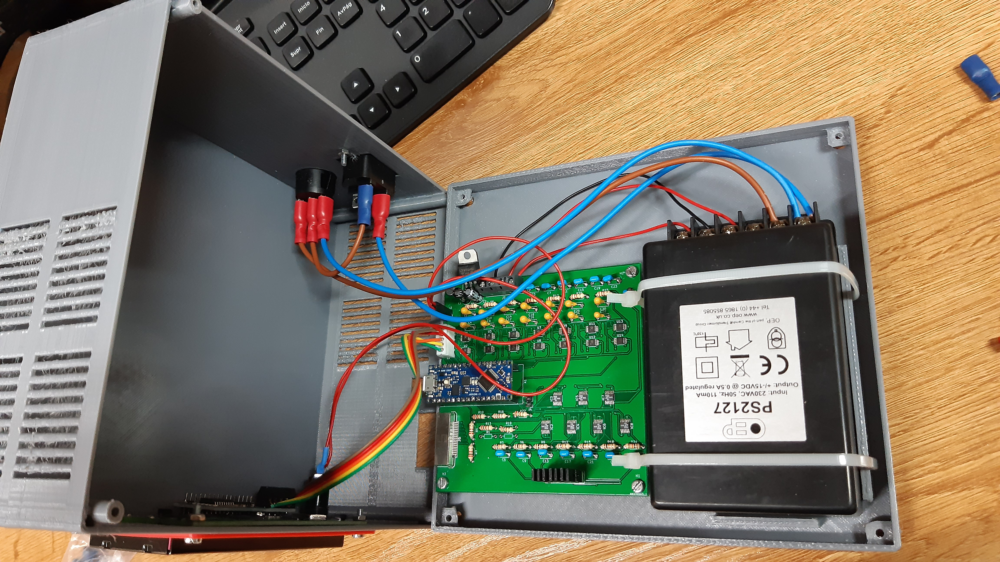
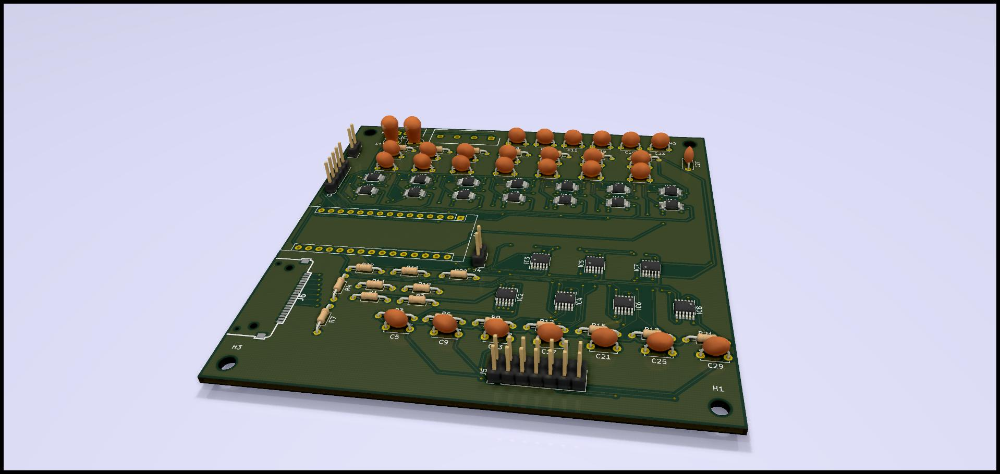
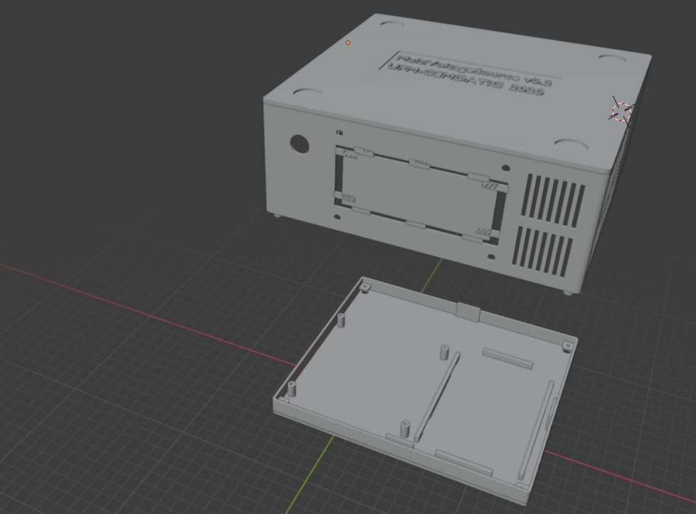

# MultiVoltageSource

<b> Design and Programming by Antonio Perez-Serrano </b> 

<b> PCB Design by Jose David Ayala </b> 

<i> CEMDATIC - ETSI Telecomunicación, Universidad Politécnica de Madrid (UPM) </i>

Version 1.0 - December 2020

 Here we describe the MultiVoltageSource project, a voltage source with 7 channels used to power up photonic integrated circuits. 

     The <b> hardware </b> is based on negative linear regulators <a href="https://www.analog.com/en/products/lt3090.html#product-overview" target="_blank">LT3090</a> and digital potentiometers <a href="https://www.analog.com/en/products/ad5290.html" target="_blank">AD5290</a> controlled by an Arduino Nano <a href="https://store.arduino.cc/arduino-nano-every" target="_blank">Every</a> or <a href="https://store.arduino.cc/arduino-nano-33-iot" target="_blank">33 IOT</a>. It offers 7 channels ranging from -0.2 V to -10.2 V. A power supply of &plusmn; 15 V or &plusmn; 12 V is needed. The current output of the power supply must be choosen depending on the application, in our case a current output of 0.5 A is enough. The schematics and PCB design have been created using <a href="https://kicad.org/" target="_blank">KiCad</a> and they can be found in the <i> Kicad Project </i> folder. The MultiVoltageSource box has been designed using <a href="https://www.blender.org/" target="_blank">Blender</a>, it can be found in the <i> Blender Project </i> folder. The box can be 3D printed using PLA or ABS material and it is designed to use M3 bolts and nuts. The MultiVoltageSource is controlled via serial port, this allows to program voltage sweeps easily.   

     The list of the materials used are:
     <ul>
          <li> 1 Arduino Nano <a href="https://store.arduino.cc/arduino-nano-every" target="_blank">Every</a> or <a href="https://store.arduino.cc/arduino-nano-33-iot" target="_blank">33 IOT</a> </li>
          <li> 7 chips <a href="https://www.analog.com/en/products/lt3090.html#product-overview" target="_blank">LT3090</a> </li>
          <li> 14 chips <a href="https://www.analog.com/en/products/ad5290.html" target="_blank">AD5290</a> </li>
          <li> 1 LCD display 20x4 characters </li>
          <li> 1 i2c/SPI LCD backpack <a href="https://learn.adafruit.com/i2c-spi-lcd-backpack" target="_blank">i2c/SPI LCD backpack</a> with the SPI enabled </li>
          <li> 1 Embedded Linear Power Supply Encapsulated PS2127 &plusmn; 15 V</li>
          <li> 1 Voltage Regulator to 5 V LD1085V50 </li>
          <li> 7 Resistors 2k &#8486; </li>
          <li> 7 Resistors 2.2k &#8486; </li>
          <li> 7 Resistors 10k &#8486; </li>
          <li> 7 Capacitors 4.7 uF </li>
          <li> 2 Capacitors 10 uF </li>
          <li> 14 Capacitors 100 nF </li>
          <li> Several PCB connectors including 1 <a href="https://www.samtec.com/products/fcs8-20-01-l-s-a-tr" target="_blank">FCS8-20-01-L-S-A-TR</a> connector </li>
          <li> 1 Switch </li>
          <li> 1 Button </li>
          <li> 1 Power Supply cable and connector </li>
          <li> Several cables </li>
     </ul>          

The cost of a MultiVoltage source is around 200 €.

     The <b> software </b> can be found in the <i> Software </i> folder. It contains the Arduino Firmware and the LabVIEW project and functions to control the MultiVoltageSource. LabVIEW 2020 version has been used to create the controlling software. At this moment, only serial communication through a USB cable is supported. Next versions will include WiFi communication.   

     Future improvements/changes:
          <ul>
               <li> WiFi communication using Arduino Nano 33 IOT </li>
               <li> Creation a stand-alone control software based on Processing </li>
          </ul>     

