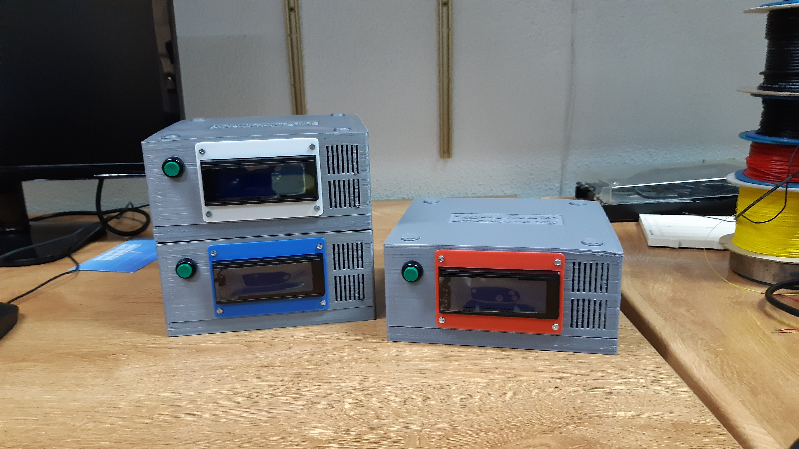

# MultiVoltageSource

<b> Designed and Programmed by Antonio Perez-Serrano </b> 

<b> PCB Designed by Jose David Ayala </b> 

<i> ETSI Telecomunicación - CEMDATIC, Universidad Politécnica de Madrid (UPM) - 2020</i>

Welcome to the MultiVoltageSource project, a voltage source with 7 channels thought to be used to power up photonic integrated circuits.

