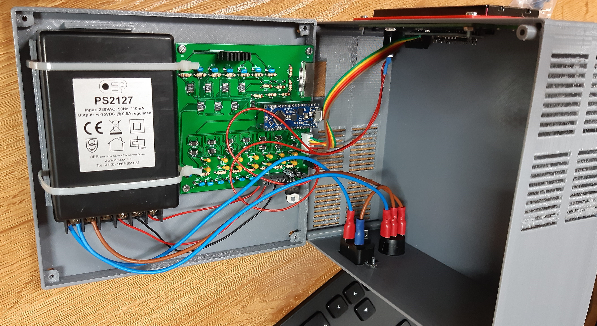

# MultiVoltageSource

<b> Design and Programming by Antonio Perez-Serrano </b> 

<b> PCB Design by Jose David Ayala </b> 

<i> CEMDATIC - ETSI Telecomunicación, Universidad Politécnica de Madrid (UPM) </i>

Version 1.0 - December 2020

 Here we describe the MultiVoltageSource project, a voltage source with 7 channels used to power up photonic integrated circuits. 

     The <b> hardware </b> is based on negative linear regulators <a href="https://www.analog.com/en/products/lt3090.html#product-overview" target="_blank">LT3090</a> and digital potentiometers <a href="https://www.analog.com/en/products/ad5290.html" target="_blank">AD5290</a> controlled by an Arduino Nano <a href="https://store.arduino.cc/arduino-nano-every" target="_blank">Every</a> or <a href="https://store.arduino.cc/arduino-nano-33-iot" target="_blank">33 IOT</a>. It offers 7 channels ranging from -0.2 V to -10.2 V. A power supply of &plusmn; 15 V or &plusmn; 12 V is needed. The current output of the power supply must be choosen depending on the application, in our case a current output of 0.5 A is enough. The schematics and PCB design have been created using <a href="https://kicad.org/" target="_blank">KiCad</a> and they can be found in the <i> Kicad Project </i> folder. The MultiVoltageSource box has been designed using <a href="https://www.blender.org/" target="_blank">Blender</a>, it can be found in the <i> Blender Project </i> folder. The box can be 3D printed using PLA or ABS material and it is designed to use M3 bolts and nuts.   

     The list of the materials used are:
     <ul>
          <li> 1 Arduino Nano Every or 33 IOT </li>
          <li> 7 chips LT3090 </li>
          <li> 14 chips AD5290 </li>
     </ul>          

     The <b> software </b>

